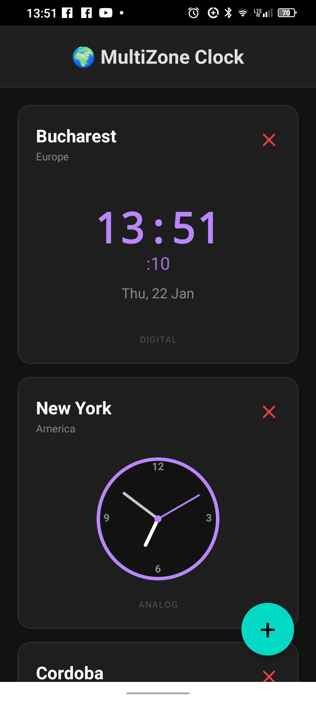

ANDROID MULTIPLE TIMEZONE CLOCK

1) Features
   
   Allows users to select and view the time in different time zones, in both digital and analog format

3) Tech: React Native, TypeScript, Expo

4) Screenshots

4) Installation

git clone https://github.com/GeoTuxMan/MultipleTimezone.github

cd MultipleTimezone

npm install

npm install -g expo-cli

5) Running the App

npx expo start

6) Testing on Physical Decice

Install Expo Go from App Store (iOS) or Google Play (Android)

Start the development server: npx expo start

Scan the QR code with Expo Go app

7) Building the app (.apk)

npm install -g eas-cli

expo install --check

eas build -p android --profile preview

Download apk file from expo.dev
